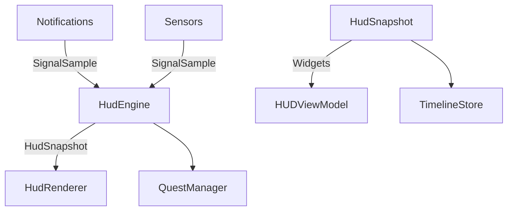

# StatusWindow HUD 리뉴얼 기획안: 현실을 플레이한다

## 1. 컨셉
- **슬로건**: "현실을 플레이한다."
- 스마트폰 알림, 센서, 사용 패턴을 온디바이스 AI가 실시간으로 해석해 RPG식 능력치·레벨·버프/디버프를 제공하는 라이프 코칭 HUD.

## 2. 핵심 스탯 구조
| 구분 | 스탯 | 데이터 신호 | 설명 |
| --- | --- | --- | --- |
| 기본 | 재력(Wealth) | 금융/소비 알림, 자산 이벤트 | 소비·저축 성향과 금융 리듬을 수치화 |
| 기본 | 체력(Vital) | 걸음 수, 운동/수면 신호 | 활동량과 회복 균형을 반영 |
| 기본 | 사고력(Cognition) | 집중 세션, 방해 알림, 앱 전환 | 몰입도와 인터럽트율 평가 |
| 기본 | 균형(Balance) | 3대 스탯 변동성 | 편향·기복을 완화하는 조정치 |
| 확장 | 사회성, 복원력, 감정 에너지 | 선택적 동의 신호 | 사용자 설정에 따라 확장 |

- 스탯 범위 0~100, 지수 이동 평균(EWMA)로 완만한 변동 유지.
- 버프/디버프는 가중치(1.1배/0.9배)와 지속시간을 갖는 `StatModifier`로 관리.

## 3. 실시간 HUD UX
- 홈/잠금 화면 위젯, 워치 컴플리케이션, Quick Settings 타일을 통해 상시 노출.
- 4개 링 게이지 + 중앙 레벨/EXP, 능력치 변경 시 짧은 애니메이션("+3 체력") 출력.
- 라이브 피드 카드: "25분 집중 중 → 사고력 +4 버프 1시간" 등.
- 버프/디버프 칩, 다음 퀘스트 CTA, 현재 코칭 옵션(산책 vs 파워냅) 제공.

## 4. 게임 메커닉 설계
- **EXP/레벨**: 일일·주간 목표 달성 시 경험치 지급, 레벨업 시 테마/배지 보상.
- **퀘스트**: 데일리(30분 걷기), 위클리(저축 알림 기록), 이벤트(회의 정시 참석).
- **스킬 트리(프리미엄)**: 재정-"지연 보상", 체력-"아침 루틴", 사고력-"딥워크" 등.
- **버프/디버프**: 운동 직후 활력 +5(2시간), 야간 알림 급증 균형 -3(1시간) 등 지속시간 포함.

## 5. 데이터 파이프라인
1. **수집**: 알림 메타데이터(카테고리/시간대), Health/Google Fit, 화면 온타임, 앱 전환, 캘린더, 사용자 집중 버튼.
2. **특징 추출**: 소비 알림 빈도, 운동·수면 규칙성, 집중 연속 시간, 인터럽트율 등.
3. **스코어링**: EWMA 업데이트 + 버프/디버프 가중치 → HUD 반영.
4. **설명가능성**: 각 스탯 변동에 대한 타임라인 카드 생성.

## 6. 아키텍처 개요

- `HudEngine`이 EWMA와 버프/디버프 조합을 계산해 `HudSnapshot`을 생성.
- `HudRenderer`/ViewModel이 위젯·워치·타일에 맞춰 표현.
- 모든 데이터는 로컬 암호화 DB(SQLCipher) 저장, 백업은 옵트인.

## 7. 온디바이스 AI 전략
- 알림 텍스트는 로컬 임베딩 후 즉시 폐기, 카테고리 분류기(TFLite/Core ML)로 처리.
- 집중 세션 자동 감지: 앱 전환 감소 + 알림 응답 감소 패턴.
- 스코어 모델은 on-device TensorFlow Lite 또는 Kotlin multiplatform 추론.

## 8. 프라이버시 가드레일
- 기본값은 최소 수집, 앱별 on/off 토글, 즉시 삭제 및 모델 리셋 제공.
- 모든 계산 로컬 처리, 서버에는 익명 통계만(옵션) 업로드.
- 투명 로그: 어떤 신호가 어떤 점수에 반영됐는지 카드로 확인 가능.

## 9. 향후 작업 로드맵
1. 신호 수집 모듈화(`SignalSample` 파이프라인) 및 온보딩 권한 UX.
2. `HudEngine`과 `HudSnapshot`을 ViewModel에 연결, 더미 데이터로 UI 프로토타입.
3. 버프/디버프 스케줄러와 퀘스트 시스템 MVP 구현.
4. 온디바이스 분류 모델(TFLite) 통합 및 최적화.
5. 사용자 피드백 기반 튜닝(스탯 민감도, 코칭 문구 A/B 테스트).

